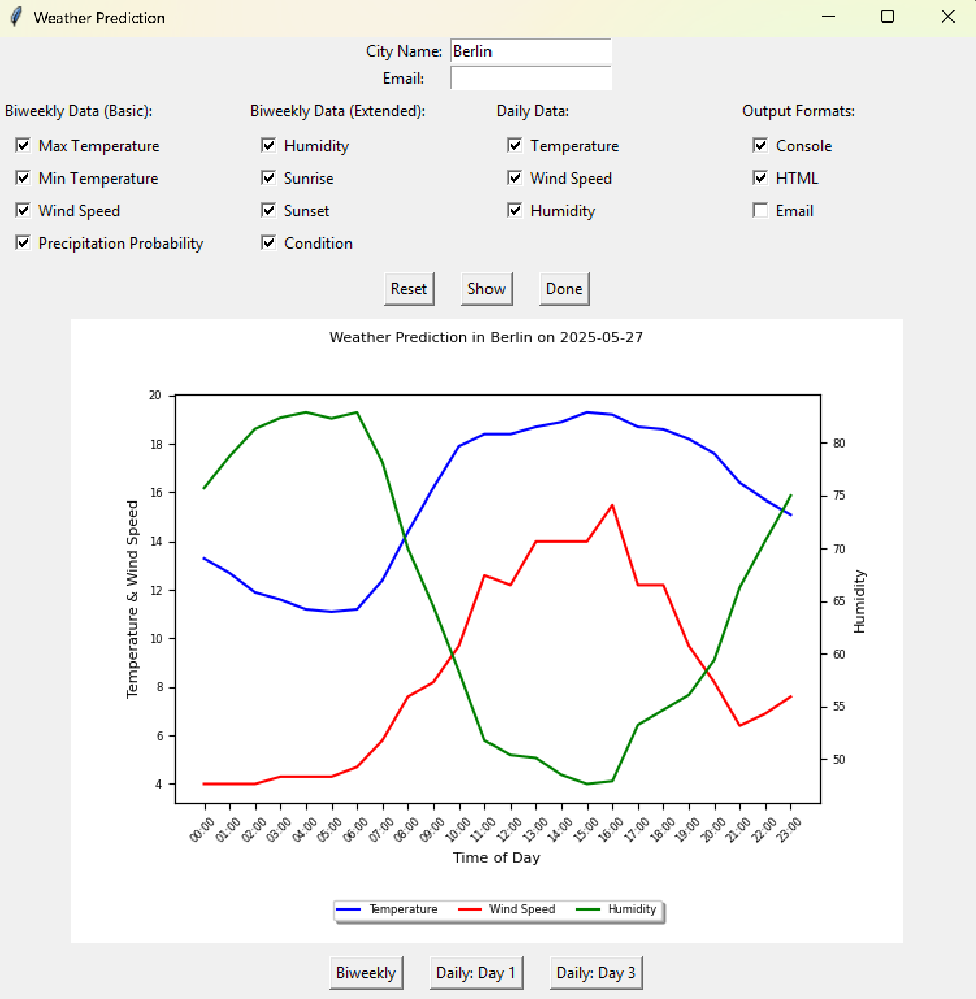
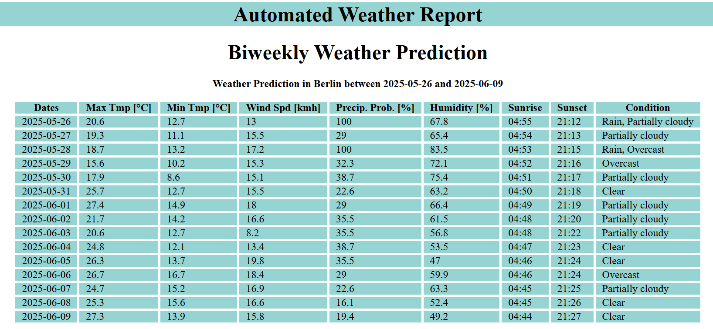

This program generates weekly and daily weather report along with weather alerts from a chosen city.
Weather data is gathered from the Visual Crossing API.

When starting the program, a GUI will be opened.

This GUI has the following features:
- You need to enter a city name and recipient email address
- It allows for user-defined weather prediction, you can choose which informations will be displayed in the program output
- The weather informations are divided into biweekly and daily informations
- The program creates separate plots for biweekly and daily weather predictions
- It also allows for user-defined output formats (console, HTML and email)
- The button "Reset" sets all checkboxes' value to zero
- The button "Show" gives a preview of the plot that will be saved in HTML data and/or email, this plot only contains the selected informations
- Once you click the "Show" button, further buttons will be displayed under the created plot to allow you to switch between the biweekly and daily plots
- You can click the "Show" button again to refresh the plot, in case you have changed the selected informations
- The button "Done" closes the GUI and outputs the weather prediction in the selected formats
- Inputing an invalid city name will end the program
- You can directly click the "Done" button if you don't need a preview of the weather data plot

The program outputs have the following feature:
- Console format displays tables with the selected informations to the console
- HTML format creates a HTML file "WeatherPrediction.html" and saves tables and plots with the selected informations to this file 
- In HTML format the displayed plots are interactive plots
- Email format creates the same HTML file, converts it to PDF format and sends it to a recipient email
- Sending the weather predicition using email will take a couple seconds

GUI

Weekly Report

